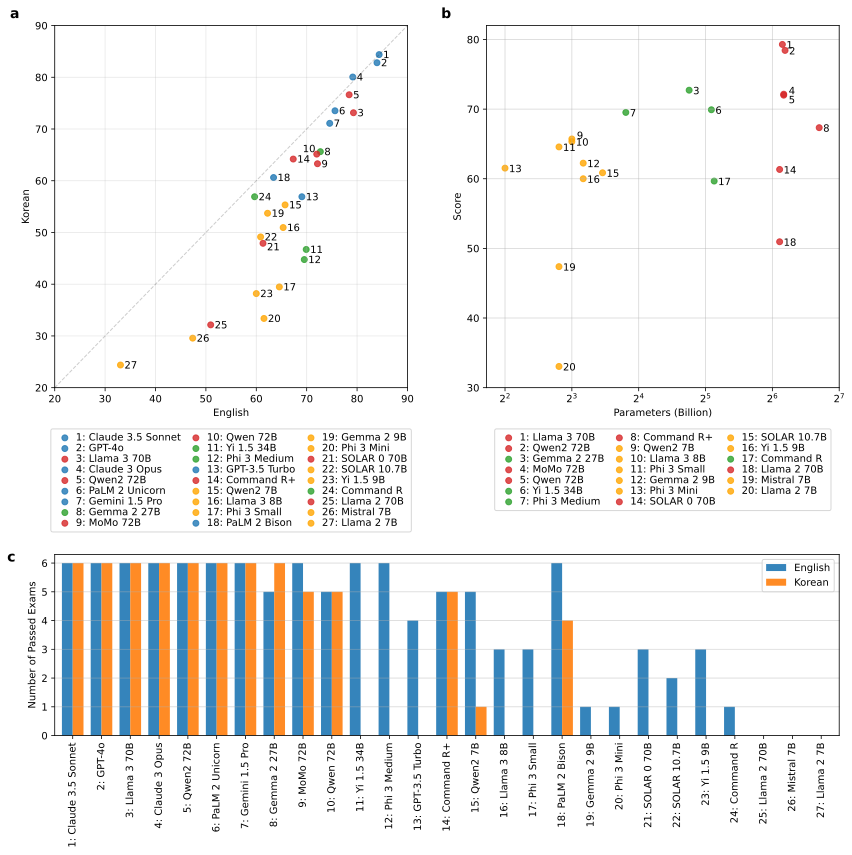

# Large Language Models Pass the Korean Pharmacist Licensing Examination: A Benchmarking Study


This repository contains the code, data, and evaluation scripts used to benchmark large language models on the Korean Pharmacist Licensing Examination (KPLE), as described in our paper:  
*"Large Language Models Pass the Korean Pharmacist Licensing Examination: A Benchmarking Study."*  
📄 [Read the full paper]()

#### Note
Due to copyright restrictions, the original KPLE datasets and processed exam texts are **not included** in this repository. However, the original questions can be accessed through the [KHPLEI official website](https://www.kuksiwon.or.kr/CollectOfQuestions/brd/m_116/list.do). All datasets used in this study were derived from the official KPLE exams. We provide code for extracting, translating, and preprocessing these datasets from the original source.

## Abstract
### Background
Large language models (LLMs) have shown remarkable advancements in natural language processing, with increasing interest in their ability to handle tasks requiring expert-level knowledge. This study evaluates the capabilities of LLMs in a high-stakes professional setting by examining their performance on the Korean Pharmacist Licensing Examination (KPLE), a comprehensive test essential for pharmacist certification in South Korea.

### Methods
We assessed 27 LLMs, including proprietary models (e.g., GPT-4o, Claude 3.5 Sonnet) and open-source models (e.g., Llama 3 70B, Qwen2 72B), using both the original Korean and English-translated versions of the KPLE from 2019 to 2024. Exam questions were translated, formatted, and analyzed using accuracy- and score-based metrics. Models were grouped by size and type, and evaluated for subject-specific performance, error rates, and progression over time. 

### Results

Seven models passed all six years of both the English and Korean exams, including five proprietary and two open-source models. Proprietary models generally outperformed open-source counterparts, though the performance gap narrowed substantially over time. The best-performing proprietary model, Claude 3.5 Sonnet, scored in the top 12% of human examinees. Larger models achieved higher accuracy overall, but recent smaller models also showed strong performance due to architectural and training improvements. Notably, LLMs struggled in topics requiring complex calculations and highly localized knowledge, indicating areas for targeted improvement through domain-specific fine-tuning.

### Conclusion
LLMs can pass the KPLE, demonstrating their growing potential as tools in professional domains. Their strengths currently lie in memorization and language comprehension, though weaknesses remain in complex reasoning and region-specific knowledge. While not substitutes for human pharmacists, LLMs may support and elevate pharmacists' professional expertise and efficiency. They hold promise as assistants in education, decision support, and administrative tasks. Continued improvements through fine-tuning, domain-specific training, and architectural advances will be key to ensuring their safe and effective use in pharmacy practice.

## Citation
If you use this code or dataset in your work, please cite:

```bibtex
@article{jang2025kple,
  title     = {Large Language Models Pass the Korean Pharmacist Licensing Examination: A Benchmarking Study},
  author    = {Jang, David Hyunyoo and Lee, Juyong},
  journal   = {medRxiv},
  year      = {2025},
  note      = {Preprint}
}
```