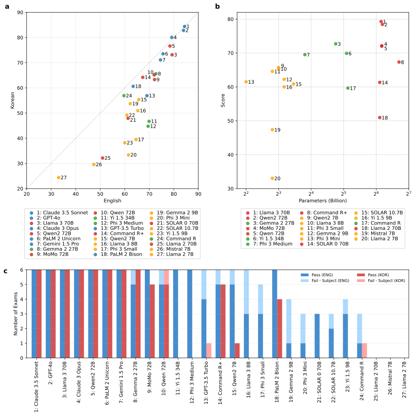

# Proprietary and Open-Source Large Language Models on the Korean Pharmacist Licensing Examination: A Comparative Benchmarking Study


[](https://doi.org/10.5281/zenodo.15209033)

This repository contains the code, data, and evaluation scripts used to benchmark large language models on the Korean Pharmacist Licensing Examination (KPLE), as described in our paper:  
*"Proprietary and Open-Source Large Language Models on the Korean Pharmacist Licensing Examination: A Comparative Benchmarking Study."*  
📄 [Read the full paper](https://www.medrxiv.org/content/10.1101/2025.04.15.25325584)

#### Note
Due to copyright restrictions, the original KPLE datasets and processed exam texts are **not included** in this repository. However, the original questions can be accessed through the [KHPLEI official website](https://www.kuksiwon.or.kr/CollectOfQuestions/brd/m_116/list.do). All datasets used in this study were derived from the official KPLE exams. We provide code for extracting, translating, and preprocessing these datasets from the original source.

## Abstract
### Background
Large language models (LLMs) have shown remarkable advancements in natural language processing, with increasing interest in their ability to handle tasks requiring expert-level knowledge. While previous studies have evaluated specific LLM models on pharmacist licensing examinations, comprehensive benchmarking across diverse model architectures, sizes, and generations remains limited. This study addresses this gap by systematically evaluating LLM capabilities on the Korean Pharmacist Licensing Examination (KPLE), a high-stakes professional certification test.

### Methods
We conducted a comprehensive benchmark of 27 LLMs, spanning proprietary models (GPT, Claude, Gemini, PaLM series) and open-source models across three size categories (small: 4-10B, medium: 14-35B, large: 70-104B parameters), using both original Korean and English-translated KPLE examinations from 2019 to 2024. Models were evaluated using accuracy-based and score-based metrics, with systematic analysis of subject-specific performance, temporal progression, cross-linguistic capabilities, and item-level difficulty patterns.

### Results


Seven models achieved passing scores across all six examination years in both languages, demonstrating substantial progress in LLM capabilities. The top-performing model, Claude 3.5 Sonnet, ranked in the top 12\% of human examinees. Temporal analysis revealed rapid improvement, particularly among open-source models, with performance gaps narrowing considerably over the 12-month study period. Parameter size correlated with performance following a logarithmic relationship, though recent architectural innovations enabled smaller models to outperform larger predecessors. Cross-linguistic evaluation showed reduced performance disparities in newer models. Subject-level analysis identified consistent strengths in memorization-intensive topics (Biopharmacy) and weaknesses in domains requiring complex calculations (Physical Pharmacy, Pharmaceutical Analysis) and region-specific knowledge (Medical Health Legislation, Pharmaceutical Quality Science).

### Conclusion
This comprehensive benchmarking study demonstrates that current LLMs can successfully pass the KPLE, with capabilities spanning diverse model architectures and sizes. Performance improvements are driven by multiple factors including parameter scaling, architectural innovations, enhanced multilingual training data, and fine-tuning strategies. Models excel in memorization and language comprehension but show limitations in complex reasoning and nation-specific knowledge domains. These findings highlight opportunities for targeted improvement through domain-specific fine-tuning and specialized training. While LLMs cannot substitute for human pharmacists, they show promise as complementary tools for education, decision support, and administrative tasks. Future development should focus on addressing identified weaknesses while leveraging the distinct advantages of both proprietary and open-source approaches to ensure safe and effective pharmaceutical applications.

## Citation
If you use this code or dataset in your work, please cite:

```bibtex
@article{jang2025kple,
  title     = {Proprietary and Open-Source Large Language Models on the Korean Pharmacist Licensing Examination: A Comparative Benchmarking Study},
  author    = {Jang, David Hyunyoo and Lee, Juyong},
  journal   = {medRxiv},
  year      = {2025},
  publisher = {Cold Spring Harbor Laboratory Press},
  doi       = {10.1101/2025.04.15.25325584}
}
```
